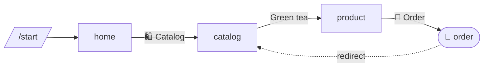

# Flow map

`app.flowchart()` draws your bot as a [Mermaid](https://mermaid.js.org)
diagram: its pages and dialogues, the /commands and menu buttons that open
them, and the buttons, redirects and dialogue starts seen while it ran.

```ts
console.log(app.flowchart());
```



GitHub draws `mermaid` code blocks in issues, pull requests and READMEs;
[Mermaid Live](https://mermaid.live) draws it too, and `mermaidLiveUrl(chart)`
makes a link that opens it there.

| shape | what |
|---|---|
| `["page"]` | a page |
| `(["📝 dialogue"])` | a dialogue |
| `[/"/command"/]` | a command from [`app.command`](commands.md) |
| `>"label"]` | a [main menu](menu.md) button |
| `-->` with a label | a button (`nav.button`, `nav.home`, …) |
| `-.->` redirect | `nav.redirect` (from a render, a middleware or a dialogue's `onFinish`) |
| `==>` | `nav.startDialogue` |
| red, dashed, ⚠️ | linked to but never registered: pressing it fails |

## Where the edges come from

Commands and menu buttons are known from the start. Buttons and redirects
are recorded when pages render, so the diagram shows what was actually used:
run your tests, click through [`easytg preview`](preview.md) (its **Flow**
tab shows the diagram as you go), or let real users use the bot. A page
that nobody opened yet shows up alone.

- Each edge is recorded once, in memory, per process; `nav.self` and other
  links from a page to itself are left out.
- `{ observed: false }` keeps only commands and menu buttons;
  `{ direction: 'TD' }` draws top-down.

[`examples/flowchart.ts`](../examples/flowchart.ts) sends its own map with
`/flow`.
